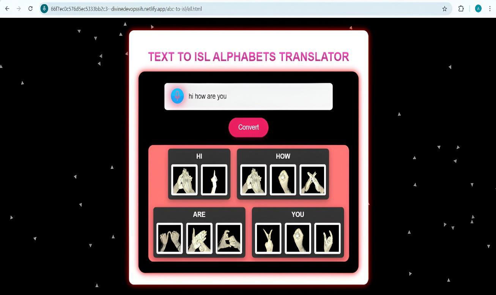

# TEXT-TO-ISL-ALPHABETS-TRANSLATOR
Text to ISL Alphabets Translator This project provides a Text to ISL Alphabets Translator that converts any input text into corresponding Indian Sign Language (ISL) alphabet hand gestures. The translator is designed to help bridge the communication gap for individuals who rely on ISL and to assist in learning sign language.

Created By Atharva Kailas Harane

# Overview Of Project
This project convert input text to ISL alphabetwise. We import the images for each letters and save it in .png formate in images folder. User can give input as audio by pressing the mic image, program convert audio to text first then convert that text into ISL by pressing Covert Button.
Program contains particles random movement animation in background and the program is responsive, mobile and user friendly. Our aim to make bridge between deaf and normal people to overcome the comunication gap between them  

# OUTPUT

